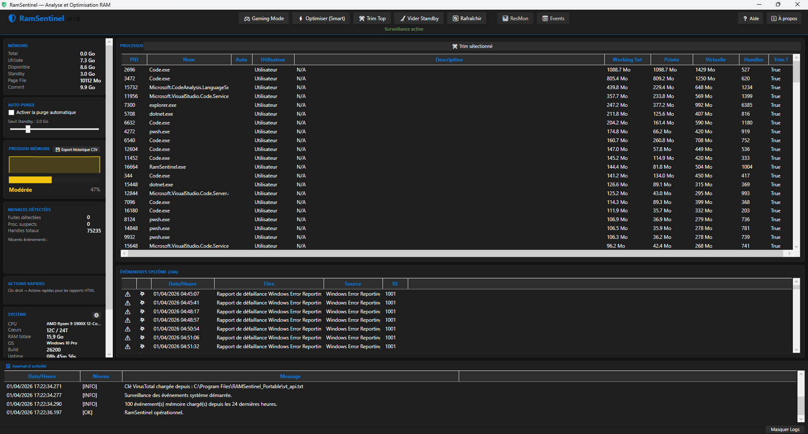
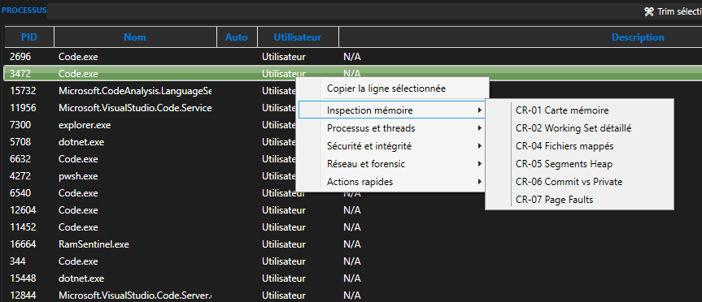

# RamSentinel v2.0


[](https://github.com/ps81frt/RAMSentinel/releases/latest)


## Table des matières

- [Guide utilisateur](#guide-utilisateur)
- [Contenu du dossier portable](#contenu-du-dossier-portable)
- [Structure du dossier](#structure-du-dossier)
- [Prerequis](#prerequis)
- [Demarrage](#demarrage)
- [Interface](#interface)
- [Actions globales](#actions-globales)
- [Clic droit sur un processus](#clic-droit-sur-un-processus)
- [VirusTotal](#virustotal)
- [Rapports HTML](#rapports-html)
- [Fichiers crees sur la machine](#fichiers-crees-sur-la-machine)
- [Nettoyage apres intervention](#nettoyage-apres-intervention)
- [Verification d'integrite](#verification-dintegrite)
- [Messages frequents](#messages-frequents)
- [Support](#support)

## Guide utilisateur

Ce document est le manuel utilisateur pour la distribution portable de RamSentinel v2.0.
Il décrit l'utilisation de l'exécutable, les actions disponibles, les fichiers écrits sur la machine, et la procédure de nettoyage après utilisation.

---

## Contenu du dossier portable

Le dossier portable contient normalement :

| Fichier | Role |
|---|---|
| `RamSentinel.exe` | Executable portable principal |
| `SHA256.txt` | Hash SHA-256 de reference |
| `RamSentinel.exe.sha256` | Hash au format exploitable avec outils de verification |
| `Readme.md` | Manuel utilisateur |

Le dossier portable ne contient pas le code source ni les fichiers de build.

---

## Structure du dossier

```
C:.
    RamSentinel.exe
    RamSentinel.exe.sha256
    Readme.md
    SHA256.txt
```


---

## Prerequis

- Windows 10 ou Windows 11 x64
- Droits administrateur recommandes
- Connexion Internet uniquement pour VirusTotal et l'ouverture des liens externes

Sans elevation administrateur, certaines actions peuvent fonctionner partiellement ou renvoyer `Acces refuse`.

---

## Demarrage

1. Ouvrir le dossier portable.
2. Lancer `RamSentinel.exe`.
3. Si possible, utiliser `Executer en tant qu'administrateur`.
4. Attendre le premier rafraichissement de la liste des processus.

Au demarrage, l'application collecte :

- l'etat global de la RAM
- la liste des processus
- le score de pression memoire
- les alertes et evenements recents

---

## Interface



ram1 montre l'interface principale complete de l'application.

L'interface est organisee en trois zones principales.

### 1. Panneau lateral gauche

Il affiche :

- les informations systeme
- l'etat de la pression memoire
- les boutons d'action globale
- la configuration VirusTotal
- les alertes et evenements recents

### 2. Liste centrale des processus

Elle affiche les processus avec notamment :

- PID
- nom
- consommation memoire
- score de dangerosite
- indicateurs de fuite ou de suspicion

Un clic droit sur une ligne ouvre le menu complet d'analyse du processus selectionne.

### 3. Barre d'etat

Elle affiche les messages de resultat, les erreurs d'acces et les confirmations d'action.

---

## Actions globales

### Rafraichir

Met a jour les informations systeme et la liste des processus.

Utiliser cette action pour :

- actualiser la RAM utilisee
- recalculer le score de pression
- rafraichir les indicateurs de fuite
- recuperer les derniers evenements

### Optimiser Smart

L'option lance une séquence d'optimisation basée sur l'état actuel de la mémoire et la pression détectée.

Selon les privilèges disponibles, elle peut effectuer :

- trim des working sets de process sélectionnés,
- flush des pages modifiées pour libérer des pages modifiées vers Standby/Free,
- purge de la Standby List via l'API native si elle est accessible.

### Trim Top

Reduit l'empreinte memoire des processus les plus consommateurs.

### Trim Selection

Reduit l'empreinte memoire du processus selectionne.

### Vider Standby

Libere la memoire de cache systeme recupable.

Cette action demande en pratique des privileges eleves.

### Gaming Mode

Applique une optimisation globale rapide orientee reduction de pression memoire.

### Export historique CSV

Exporte l'historique recent de pression memoire au format CSV.

---

## Clic droit sur un processus



ram2 montre le menu clic droit et ses sous-menus (inspection memoire, processus et threads, securite et integrite, reseau et forensic, actions rapides).

Le menu contextuel regroupe les fonctions d'inspection, de securite et d'export.

### Actions rapides

- Rapport HTML individuel
- Rapport HTML systeme
- Verifier sur VirusTotal
- Ouvrir l'emplacement
- Rechercher en ligne
- Forcer le Trim

### Inspection memoire

Permet d'ouvrir les vues de detail sur :

- memory map
- working set detail
- modules charges
- fichiers mappes
- heap
- commit vs private
- page faults

### Détails techniques des inspections CR

- **CR-01 Carte mémoire** : énumération des régions mémoire du processus avec `VirtualQueryEx`, collecte de `BaseAddress`, `RegionSize`, `State`, `Type`, `Protection` et chemin du fichier mappé si disponible.
- **CR-02 Working Set détaillé** : lecture de `PROCESS_MEMORY_COUNTERS_EX` et catégorisation des pages via `QueryWorkingSetEx` pour produire les valeurs `Private`, `Shareable` et `Shared`.
- **CR-03 Modules/DLL chargés** : énumération des modules chargés dans le processus, affichage de l'adresse de base, de la taille, du chemin et des informations de signature Authenticode.
- **CR-04 Fichiers mappés** : détection des régions de type `MEM_MAPPED`, récupération des chemins mappés avec `GetMappedFileName`.
- **CR-05 Segments Heap** : approximation des segments de type privé et commit pour représenter les zones de mémoire liées aux allocations de processus.
- **CR-06 Commit vs Private** : comparaison des octets committés (`CommitCharge`) et des octets privés à partir des compteurs mémoire et des régions de processus.
- **CR-07 Page faults** : affichage des compteurs de fautes de page, avec distinction entre fautes lentes et rapides lorsque les données sont disponibles.

### Processus et threads

Permet d'acceder a :

- suspendre / reprendre
- minidump
- handles
- threads
- priorite
- affinite CPU

### Détails techniques Processus et threads

- **CR-08 Suspendre/Reprendre** : utilise `NtSuspendProcess` et `NtResumeProcess` pour changer l'état d'exécution du processus.
- **CR-09 MiniDump** : création de mini ou full dump via `MiniDumpWriteDump`.
- **CR-10 Handles** : énumération des handles ouverts par le processus et affichage du nombre total.
- **CR-11 Threads** : liste des threads du processus avec TID, priorité, temps CPU utilisateur et noyau.
- **CR-12 Priorite** : modification de la classe de priorité du processus (`SetPriorityClass`).
- **CR-13 Affinite CPU** : configuration du masque d'affinité du processus pour limiter ou autoriser des cœurs spécifiques.

### Securite et integrite

Permet d'afficher :

- authenticode
- token de securite
- arbre de processus
- connexions reseau
- detection d'injection
- anti-hollowing

### Détails techniques Sécurité et intégrité

- **CR-14 Token sécurité** : lecture des informations de token du processus et des privilèges activés.
- **CR-15 Authenticode** : vérification de la signature du module via `WinVerifyTrust`.
- **CR-16 Arbre de processus** : construction de la hiérarchie parent/enfant à partir des informations de processus.
- **CR-17 Connexions réseau** : liste des connexions TCP/UDP associées au PID, avec adresses locales et distantes.
- **CR-20 Détection de fuite mémoire** : suivi de la croissance du working set et des allocations pour identifications de fuites potentielles.
- **CR-24 Détection injection DLL** : comparaison du contenu mémoire et du contenu disque pour repérer des modules injectés ou modifiés.
- **CR-25 Anti-Hollowing** : comparaison des images en mémoire et sur disque pour détecter les incohérences de sections.

### Intelligence

Permet d'ouvrir :

- score de dangerosite
- detection de fuite memoire
- historique working set

### Détails techniques Intelligence

- **CR-19 Score de dangerosité** : calcul d'un score composite basé sur des facteurs tels que les modules unsigned, l'activité réseau, la croissance du working set et les caractéristiques du processus.
- **CR-20 Détection de fuite mémoire** : monitoring des valeurs de mémoire du processus sur le temps pour détecter une augmentation anormale.
- **CR-21 Historique Working Set** : enregistrement périodique des valeurs de working set pour construire une courbe temporelle.
- **CR-22 Export Forensic** : création de rapports JSON et HTML à partir des données collectées pour les processus ou l'état système, écrits dans `%LOCALAPPDATA%\RamSentinel\Reports\`.
- **CR-23 Mode Gaming** : optimisation appliquée en lot, de type trim / purge ciblés, destinée à réduire la pression mémoire globale.

---

## VirusTotal

La verification VirusTotal est optionnelle.

### Configurer la cle API

1. Aller dans la section `VIRUSTOTAL (API)`.
2. Saisir la cle API dans le champ prevu.
3. Cliquer sur `Enregistrer` pour sauvegarder la cle dans un fichier.

Autre possibilite :

- cliquer sur `📂` pour charger une cle depuis un fichier existant

### Utiliser VirusTotal

1. Selectionner un processus.
2. Faire un clic droit.
3. Choisir `Verifier sur VirusTotal`.

L'application calcule le hash SHA-256 du binaire local, puis interroge l'API VirusTotal si la cle est disponible.

### Effacer la cle apres usage

Le bouton `🗑️` supprime :

- le fichier contenant la cle
- le fichier pointeur `vt_api_path.txt`
- la cle conservee en memoire par l'application

Cette operation est recommandee avant de rendre une machine cliente.

---

## Rapports HTML

Deux rapports HTML sont disponibles dans le menu contextuel.

### Rapport individuel

Ce rapport porte sur le processus selectionne.

Il peut contenir :

- resume du processus
- score de dangerosite
- modules
- threads
- reseau
- informations de securite
- token et privileges
- details de dump si disponibles

### Rapport systeme

Ce rapport porte sur l'etat global de la machine.

Il peut contenir :

- KPI memoire
- pression globale
- top processus RAM
- resume systeme

### Emplacement des rapports

Les fichiers HTML sont ecrits dans :

`%LOCALAPPDATA%\RamSentinel\Reports\`

Ils s'ouvrent automatiquement dans le navigateur par defaut.

---

## Fichiers crees sur la machine

Meme en mode portable, l'application peut ecrire des donnees dans le profil utilisateur Windows.

### Emplacements utilises

| Emplacement | Contenu |
|---|---|
| `%LOCALAPPDATA%\RamSentinel\Logs\` | Journaux d'execution |
| `%LOCALAPPDATA%\RamSentinel\Reports\` | Rapports HTML |
| `%LOCALAPPDATA%\RamSentinel\vt_api_path.txt` | Pointeur vers le fichier de cle VirusTotal |

---

## Nettoyage apres intervention

Pour ne pas laisser de traces sur une machine cliente :

1. Supprimer la cle VirusTotal avec le bouton `🗑️` si elle a ete configuree.
2. Fermer RamSentinel.
3. Supprimer le dossier `%LOCALAPPDATA%\RamSentinel\` si les logs et rapports ne doivent pas etre conserves.

---

## Verification d'integrite

Pour verifier que l'executable n'a pas ete modifie :

```powershell
certutil -hashfile .\RamSentinel.exe SHA256
```

Comparer le resultat avec le contenu de `SHA256.txt` ou `RamSentinel.exe.sha256`.

---

## Messages frequents

### `Acces refuse`

Le processus cible ou l'action demandee necessite des privileges plus eleves.

### `Chemin d'acces invalide`

Le binaire du processus n'est pas accessible, ou Windows ne renvoie pas de chemin exploitable.

### VirusTotal indisponible

Verifier :

- la presence de la cle API
- l'acces Internet
- les limites du compte VirusTotal utilise

---

## Support

- Depot : https://github.com/ps81frt/RAMSentinel
- Releases : https://github.com/ps81frt/RAMSentinel/releases
- Issues : https://github.com/ps81frt/RAMSentinel/issues

---

Version : 2.0
Licence : MIT
Auteur : ps81frt


